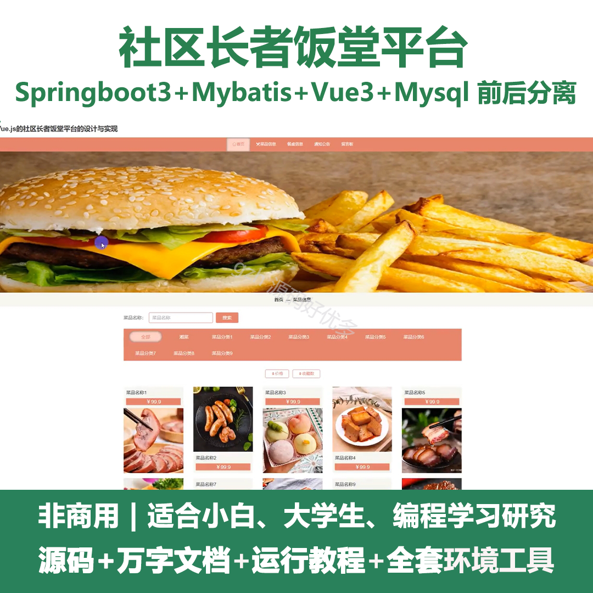
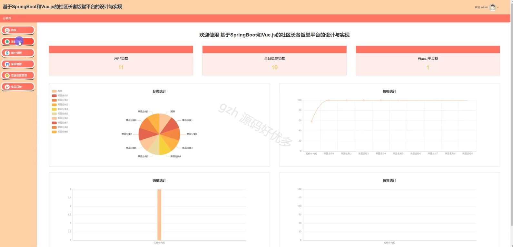
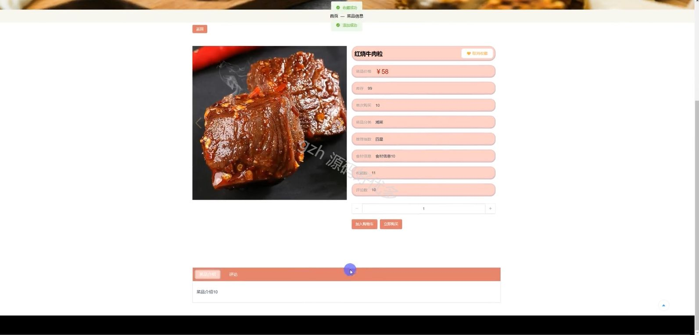
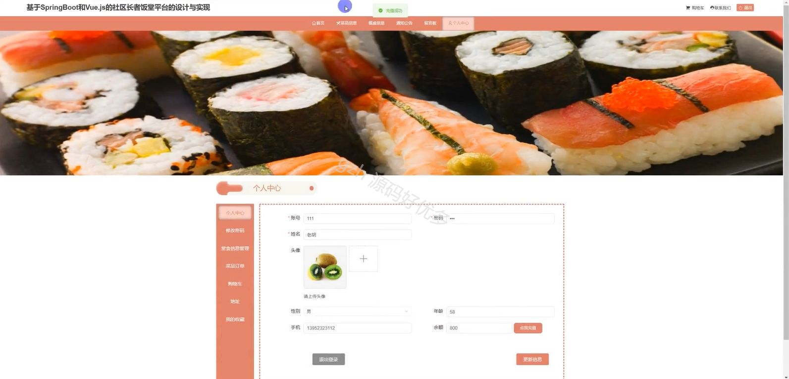
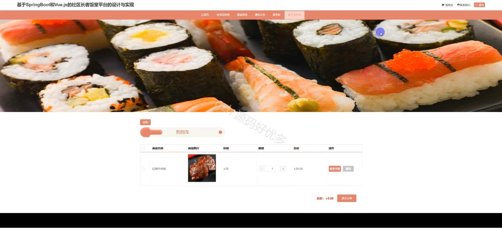
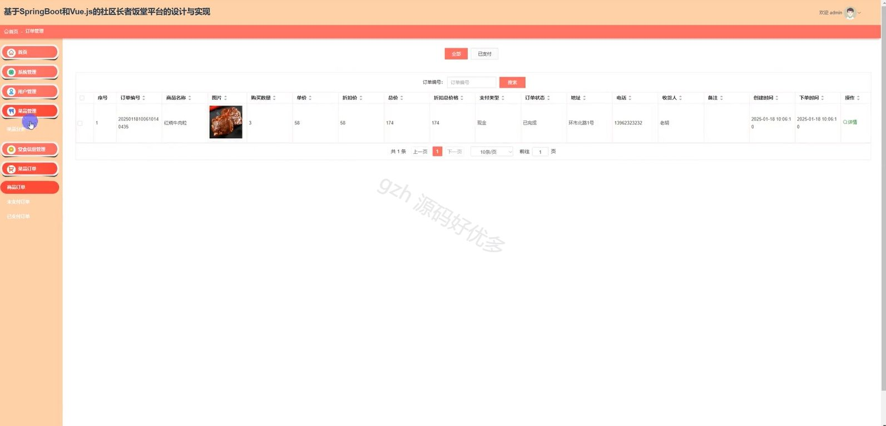
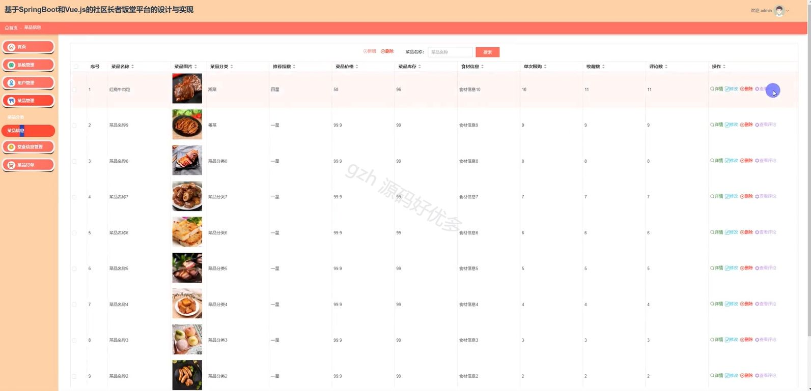
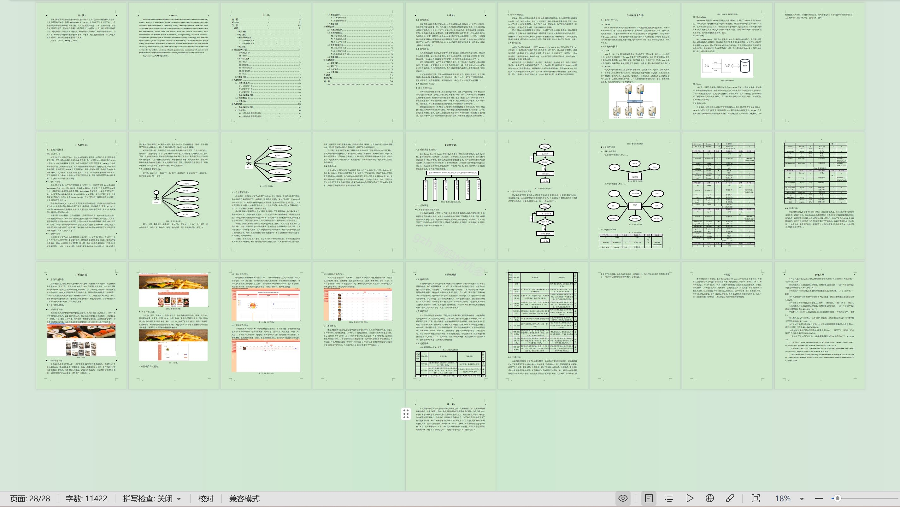

# springbootA501D
springbootA501D社区长者饭堂平台
## 查看主页获取源码

### 一、关键词

菜品信息、菜品订单、堂食信息

 

### 二、作品包含

源码+数据库+设计文档万字+全套环境和工具资源+部署教程

 

### 三、项目技术

前端技术：Html、Css、Js、Vue3.0、Element-plus
后端技术：Java、SpringBoot3.0、MyBatis

  

 

### 四、运行环境（以下版本亲测，其他版本未知，请自测）

开发工具：IDEA/eclipse  + VSCODE

数据库：MySQL5.7（最低要5.7版本）

数据库管理工具：Navicat10以上版本

环境配置软件： jdk17 + Maven3.6.3

前端Nodejs：20

浏览器：谷歌浏览器

 

### 五、项目介绍

项目编号：springbootA501D

社区长者饭堂平台通过提供便捷的餐饮服务、适老化餐食供应及社交互动空间，解决社区长者用餐难题并满足其情感交流需求，提升晚年生活便利性与幸福感。

角色：管理员、用户

用户功能：注册、登录、首页、菜品信息、餐桌信息、通知公告、留言板、个人中心、修改密码、堂食信息管理、菜品订单、购物车、地址、我的收藏。

管理员功能：登录、首页、系统管理、用户管理、菜品管理、堂食信息管理、菜品订单。

 

### 六、运行截图

